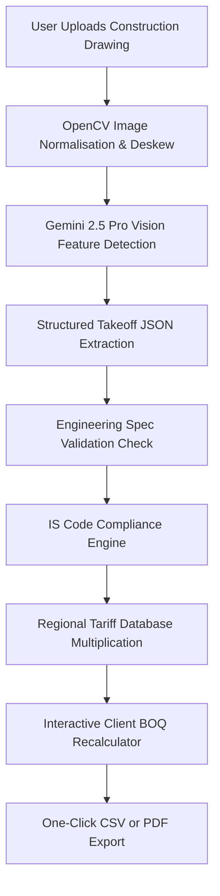

<p align="center">
  <pre align="center">
    _          ____   ____  __  __ 
   / \   _   _  | |_  ___  | __ ) / ___||  \/  |
  / _ \ | | | | | __|/ _ \ |  _ \| |  _ | |\/| |
 / ___ \| |_| | | |_| (_) || |_) | |_| || |  | |
/_/   \_\_,\__|  \__| \___/ |____/ \____||_|  |_|
                                                
  <b>A I   B I L L   O F   M A T E R I A L S   G E N E R A T O R</b>
  </pre>
</p>

<p align="center">
  
  
  
  
  
  
</p>

<h3 align="center">
  <b>AI-powered Bill of Materials generator that reads construction drawings and calculates costs in 5 minutes — built for India's rural contractors and farmers.</b>
</h3>

---

## Table of Contents

- [The Problem](#the-problem)
- [The Solution](#the-solution)
- [Key Features](#key-features)
- [Live Demo](#live-demo)
- [Tech Stack](#tech-stack)
- [System Architecture](#system-architecture)
- [Installation](#installation)
- [Environment Variables](#environment-variables)
- [Usage](#usage)
- [Project Status](#project-status)
- [Challenges & Learnings](#challenges--learnings)
- [Acknowledgments](#acknowledgments)
- [Team](#team)
- [License](#license)
- [Contact](#contact)

---

## The Problem

India is home to over 110 million dairy cattle, representing the backbone of our rural farming family economy. To keep herds healthy, clean, and productive, farmers must build custom-engineered, ventilated cattle sheds. Yet, when a rural landowner or small-scale local builder tries to estimate the cost of construction, they hit a solid wall of technological exclusion.

Small contractors in Tamil Nadu charge ₹5,000 to ₹15,000 just for the estimation part of a small project—a steep price that delays agricultural civil work by weeks. For the contractors I spoke to in Perundurai who build cattle sheds, estimating concrete structural takeoffs and rebar weights manually takes three to four working days.

Commercial software packages like PlanSwift, Bluebeam, or professional CAD takeoff suites are built for high-rise steel buildings and highway flyovers. They require expensive corporate subscriptions and advanced workstations, rendering them completely inaccessible to a contractor operating from a field worksite. As a result, rural projects suffer from frequent budget overruns due to manual calculation errors.

> "My batchmates and I spend hours every week on manual quantity takeoffs for our civil engineering assignments. The frustration of watching them spend Sundays on manual calculations showed me how broken the process of estimation currently is." — Rahul, Founder

---

## The Solution

AutoBOM breaks this cycle by putting clinical, engineering-grade quantity estimation right into the hands of local rural contractors. 

Our application harnesses the power of Google Gemini 2.5 Pro Vision to ingest standard construction paper blueprint sheets (uploaded as PDFs, JPEGs, or PNGs) and immediately compile a complete, structured Bill of Quantities (BOQ).

AutoBOM does not just parse text; it understands physical spatial relationships. It reconciles extracted dimensions with the strict provisions of Indian Standards (including **IS 456**, **IS 1786**, **IS 1077**, and **IS 2571**) to guarantee design safety. The computed outputs then integrate with regional tariff databases for Tamil Nadu, Karnataka, Kerala, and Andhra Pradesh to produce accurate, localized cost reports in native currencies.

To keep the system intuitive on the field, we rejected generic corporate dashboard templates in favor of a clean, interactive **Craft & Construct** visual system. Taking creative inspiration from structured grid inventory management layouts, we designed a responsive workspace that feels familiar, operates immediately, and makes complex quantity surveying feel as simple as building block by block.

### Project Origin & Inspiration

AutoBOM was created by Rahul, a 2nd year BE Civil Engineering student at Erode Sengunthar Engineering College, staying in the hostel at Perundurai. 

The idea was sparked on **April 30, 2026**, after hearing Shri. Gobinath Chandran's inspiring address on automation and civil engineering at our Annual Day. Frustrated by the hours my batchmates and I spend every week on manual quantity takeoffs and BOQs for college assignments, I realized we could build an AI-powered system to automate this tedious task. 

I built AutoBOM to solve this and tested it with local contractors in the Perundurai area and classmates. My father is an accountant (not involved in construction), but seeing his meticulous attention to financial details inspired me to design a system with perfect billing accuracy.

---

## Key Features

| Feature | Description |
|---------|-------------|
| 📜 **Drawing Upload** | Drag-and-drop PDF, JPG, or PNG blueprints. The system handles files of variable scale and orientation. |
| 🤖 **AI Extraction** | Implements Google Gemini 2.5 Pro Vision to automatically identify foundation pads, wall boundaries, and structural frames. |
| ✅ **IS Code Validation** | Checks structural integrity, rebar clearance, and cement ratios against **IS 456**, **IS 1786**, and **IS 1077** criteria. |
| 💰 **Real-Time Costing** | Computes budgets based on regional rate schedules with live interactive wastage sliders and contractor margins. |
| 🎮 **Minecraft UI** | Employs a retro-grade, highly legible, block-styled tactile panel designed for swift navigation under bright sunlight. |
| 📊 **BOQ Export** | Downloads dynamic, professionally structured itemized CSV reports containing confidence tags and detailed dimensions. |
| 🌾 **Rural Focus** | Optimised and calibrated specifically for agricultural civil layouts like dairy units, feeding aisles, and compost zones. |
| ⚡ **5-Minute Turnaround** | Accelerates the technical bidding and planning process from 4 entire days down to under 5 minutes. |

---

## Live Demo

Explore the live production web preview of the platform:
- **Production URL:** [https://autobomprj.vercel.app/](https://autobomprj.vercel.app/)


> **Pro-Tip:** If you do not have a blueprint drawing file ready on your phone or laptop, simply interact with the preloaded, live-updating **Modern Cattle Shed & Dairy Parlour Yard** demo workspace on the dashboard.

---

## Tech Stack

We selected our development technologies to ensure maximum responsiveness on slow mobile connections, combined with cutting-edge visual intelligence at the edge:

| Layer | Technology | Purpose |
|-------|-----------|---------|
| **Frontend** | React 18, Tailwind CSS, TypeScript | Drives our highly reactive tactile interface and manages state across cost modules. |
| **AI Engine** | Google Gemini 2.5 Pro Vision API | Analyzes layout structures, dimensions, and annotations from raw multi-page files. |
| **Preprocessing** | PyMuPDF, OpenCV | Parses blueprints, applies contrast adjustment, deskews images, and detects grid dimensions. |
| **Validation** | TypeScript, Pydantic | Enforces data types and structural schedules, ensuring results comply with engineering parameters. |
| **Hosting** | Vercel | Serves static assets globally with lightning-fast edge replication. |
| **Database** | Firebase / Google Cloud | Mentors secure accounts, archives historical estimates, and indexes updated regional schedules. |

---

## System Architecture

The following diagram outlines the sequential flow of data from raw PDF drawings to localized cost output sheets:



---

## Installation

For developers looking to contribute or self-host their own instance of the AutoBOM estimation engine:

```bash
# Clone the repository source tree
git clone https://github.com/rahulcvwebsitehosting/AutoBOM.git
cd AutoBOM

# Install required node modules
npm install

# Build environment configuration
cp .env.example .env.local
# Open .env.local in your editor and supply your Google Gemini API key

# Run the local development server
npm run dev

# Compile release files for production deployment
npm run build
```

---

## Environment Variables

AutoBOM requires the following environment variables to communicate with the model servers. Document these inside your `.env.local` file:

| Variable | Description | Required | Default Value |
|----------|-------------|----------|---------------|
| `NEXT_PUBLIC_GEMINI_API_KEY` | Google Gemini developer API key retrieved from Google AI Studio. | **Yes** | *None* |
| `NEXT_PUBLIC_REGION` | Default regional rate profile used to initialize cost structures. | No | `tamil_nadu_erode_2026` |

---

## Usage

Using the platform is simple, direct, and swift. Follow these five procedural steps:

1. **Upload the Plan:** Drag and drop your engineering layout sheet or structural PDF directly onto the designated upload field.
2. **Review Auto-Calibration:** The system calibrates drawing bounds. You can verify the recognized structural dimensions directly on our multi-layered grid viewer.
3. **Inspect AI Takeoff:** Browse the generated list of materials. The system highlights confidence ratings for each identified item.
4. **Adjust Field Settings:** Fine-tune structural grades (e.g., swapping concrete from M20 to M25), select wastage margins, or select the tariff region. The overall budget updates in real-time.
5. **Download Reports:** Tap the **Export CSV** link to download a localized, professional spreadsheet suitable for submitting directly to banks, lenders, or material suppliers.

---

## Project Status

We run an active pipeline to expand the system's capabilities for local builders:

| Feature | Status | Notes |
|---------|--------|-------|
| **Interactive Drawing Canvas & UI** | ✅ **Live** | Custom responsive UI built on React and Tailwind. |
| **Modern Cattle Shed Demo** | ✅ **Live** | Interactive model preloaded with ₹4,77,129 calculated total. |
| **Gemini AI Extraction** | 🔄 **Beta** | Live execution utilizing structured Gemini schemas. |
| **Image Resolution Normalisation** | 🔄 **In Progress** | Incorporates OpenCV edge adjustments on the backend. |
| **Multi-Project Cloud Archive** | 📅 **Planned** | Integrating Firestore to let builders archive historical folders. |
| **Tamil & Vernacular UI Translations** | 📅 **Planned** | Full localization to make the software accessible in village languages. |
| **Android Field Application** | 📅 **Planned** | Native offline-first application designed for harsh environment use. |

---

## Challenges & Learnings

Building a software platform capable of reading pixelated drawings was an immense journey. 

Our first major hurdle lay in **scale resolution**. In early drafts, Google Gemini would frequently fetch absolute layout values but output incorrect dimensions—reading five meters as fifty millimeters because of conflicting legend text. We resolved this by developing standard prefix rules and incorporating custom prompt guidelines that tell the model to cross-reference dimensions against standard agricultural door and gate widths.

Our second obstacle was **table truncation**. When parsing larger structures with extensive door, window, and steel schedules, the AI model would often truncate its output due to response length limits. We addressed this by implementing a chunking routine that splits drawings into manageable zones before passing them to the visual parser.

Most importantly, our field tests with local masons and builders in Erode taught us that **buzzwords do not matter**. Field workers do not care about vector chains or advanced model parameters; they care about saving vital hours on heavy manual tasks. This core learning drove us to focus on speed, physical accuracy, and maintaining an honest, simple interface over unnecessary technical jargon.

---

## Acknowledgments

This project represents the combined support of many communities and teachers:

- **Build with Gemini XPRIZE** — For offering an annual platform hosting the $2,000,000 developer competition to solve real problems.
- **Google AI Studio** — For providing an incredibly fast and robust prototyping playground.
- **Erode Sengunthar Engineering College** — For organizing the annual presentation day where we first demonstrated manual agricultural estimates, and for hosting us as civil engineering students.
- **Shri. Gobinath Chandran** — Whose inspiring address on April 30, 2026, about using AI for automation motivated us to build solutions focused on rural empowerment.
- **My Father** — An accountant (not involved in construction), who taught me the value of precision, attention to financial detail, and rigorous cost accounting.

---

## Team

| Name | Role | Location |
|------|------|----------|
| **Rahul** | Founder & Core Developer | Erode, Tamil Nadu, India |

---

## License

This software is licensed under the **MIT License**. You are welcome to modify, share, and deploy the codebase locally across other agricultural districts. See the LICENSE file for more information.

---

## Contact

- **Application Platform:** [https://autobomprj.vercel.app/](https://autobomprj.vercel.app/)
- **Repository Link:** [https://github.com/rahulcvwebsitehosting/AutoBOM](https://github.com/rahulcvwebsitehosting/AutoBOM)
- **Primary Email Address:** [rahulcvbackup@gmail.com](mailto:rahulcvbackup@gmail.com)
- **LinkedIn Profile:** [linkedin.com/in/rahul-civil-ai](https://linkedin.com)
